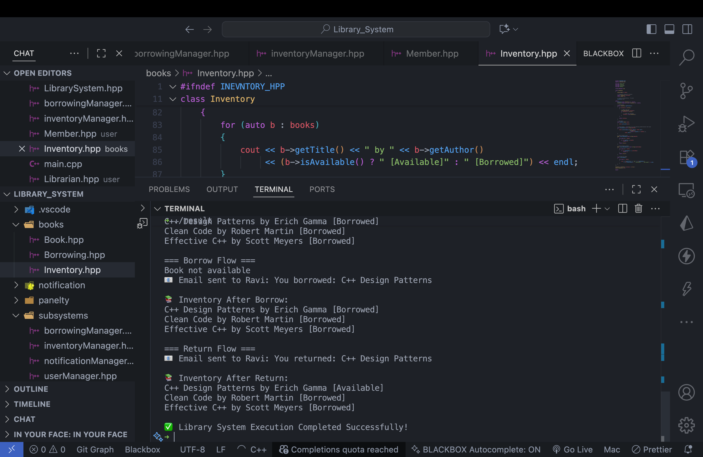

# 📚 Library Management System (C++)

This project demonstrates a simple Library Management System built in C++ using OOP and design patterns like Singleton and Facade.

## 🏗️ System Design Overview

## 🖥️ Output Screenshot

